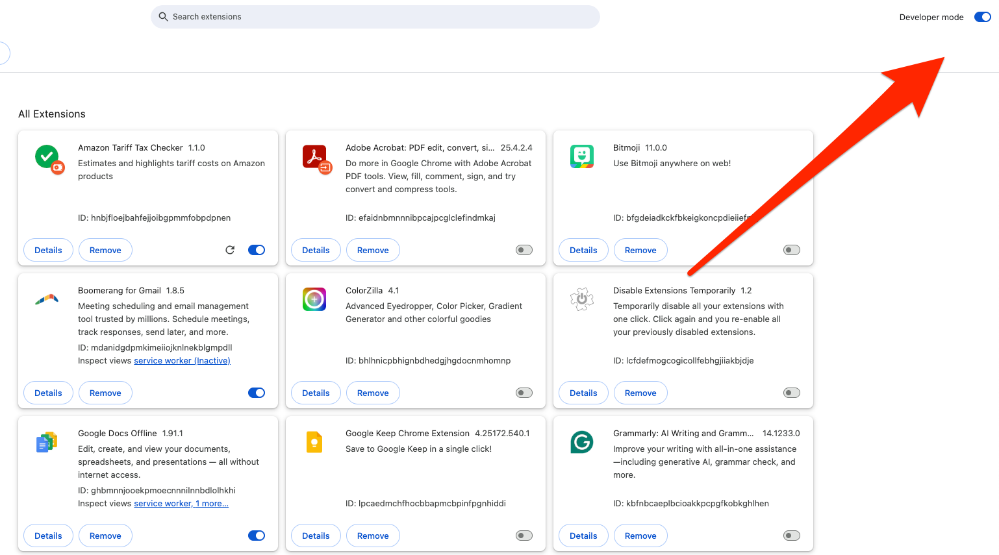

# Detailed Installation Guide: Amazon Tariff Tax Checker

This guide provides step-by-step instructions on installing and using the Amazon Tariff Checker Chrome extension from source code.

## Prerequisites

- Google Chrome browser (version 88 or later recommended)
- Basic familiarity with GitHub or downloading files from the internet

## Installation Process

### Method 1: Installing from GitHub

#### Step 1: Get the Code
1. Visit the GitHub repository at `https://github.com/yourusername/amazon-tariff-checker`
2. Click the green "Code" button
3. Select "Download ZIP"
4. Once downloaded, extract the ZIP file to a folder on your computer
   - Right-click the ZIP file and select "Extract All..." (Windows) or double-click (Mac)
   - Choose a location you can easily find, like your Desktop

#### Step 2: Load in Chrome
1. Open Chrome and type `chrome://extensions/` in the address bar
2. Look for the "Developer mode" toggle in the top-right corner and turn it ON
   
3. Click on the "Load unpacked" button that appears
   
4. Navigate to the folder where you extracted the extension files
5. Select the main folder (the one containing manifest.json) and click "Open"

#### Step 3: Verify Installation
1. The extension should now appear in your list of installed extensions
2. You should see the extension icon in your Chrome toolbar (top-right of browser)
   - If you don't see it, click the puzzle piece icon to see all extensions
   - Click the pin icon next to Amazon Tariff Tax Checker to keep it visible

### Method 2: Installing from a Local Copy

If someone shared the extension files with you directly:

1. Extract the files to a folder if they're in a ZIP format
2. Follow steps 1-5 from "Step 2: Load in Chrome" above

## Using the Extension

1. Visit Amazon.com
2. Browse to any product page
3. The extension will automatically check if the product might incur tariff taxes
4. You'll see a banner at the top of the page with information about potential tariffs

## Keeping the Extension Updated

Since the extension isn't installed from the Chrome Web Store, it won't update automatically. To update:

1. Download the newest version from GitHub
2. Go to `chrome://extensions/`
3. Find the Amazon Tariff Tax Checker extension and click "Remove"
4. Follow the installation steps again with the new files

## Troubleshooting

### Extension Not Working?
1. Ensure you've correctly loaded the unpacked extension
2. Make sure you're on Amazon.com (not a regional variant like Amazon.co.uk)
3. Visit `chrome://extensions/` and check if there are any error messages
4. Try reloading the extension by clicking the refresh icon on the extension card

### Banner Not Appearing?
1. Refresh the Amazon product page
2. Check if you have other extensions that might be interfering
3. Try disabling and re-enabling the extension

### Browser Says "Developer Mode Extensions Warning"?
This is normal for unpacked extensions. Just click "Cancel" when this appears at Chrome startup.

## Uninstalling

To remove the extension:
1. Go to `chrome://extensions/`
2. Find the Amazon Tariff Tax Checker extension
3. Click "Remove" and confirm
